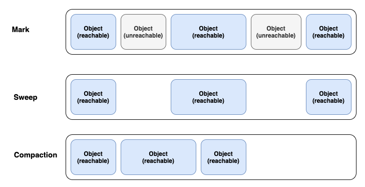

### JVM 구조

<details>
    <summary> 예비 답안 </summary>
    <br />

- `jvm` 은 자바 가상 머신입니다. 
    - 자바와 운영체제 사이에서 중개자 역할을 수행하며 자바가 운영체제에 구애받지 않고 프로그램을 실행할 수 있도록 도와줍니다.
- JVM 의 구조는 
    - JVM 내로 클래스 파일을 로드하고, 링크를 통해 배치하는 작업을 수행하는 모듈인 `Class Loader`
    - 클래스 로더를 통해 JVM 내의 Runtime Data Area 에 배치된 바이트 코드들을 명령어 단위로 실행하는 `Execution Engine`
    - 힙 메모리 영역에 생성된 객체들 중에서 참조되지 않은 객체들(Unreachable)을 탐색 후, 제거하는 역할을 하는 `Garbage Collector`
    - JVM 의 메모리 영역으로, 자바 애플리케이션을 실행할 때 사용되는 데이터들을 적재하는 영역인 `Runtime Data Area`
    
```
jvm 은 크게 jvm 내로 클래스 파일을 로드하고, 링크를 통해 배치하는 작업을 수행하는 모듈인 클래스 로더(Class Loader), jvm 내의 Runtime Data Area에 배치된 코드들을 명령어 단위로 실행하는 실행 엔진(Execution Engine), JVM 의 메모리 영역으로, 자바 애플리 케이션을 실행할 때 사용되는 데이터들을 적재하는 런타임 데이터 영역(Runtime Data Area), 힙 메모리 영역에 더 이상 참조되지 않는 객체들을 탐색 후 제거하는 역할을 하는 갈비지 컬렉터(Garbage Collector)으로 구성됩니다.
```
</details>

-----------------------

### JVM 의 메모리 구조

<details>
    <summary> 예비 답안 </summary>
    <br />

- JVM 의 메모리 구조는 모든 쓰레드에서 공유되는 Method 영역과 Heap 영역, 나머지 영역인 PC Register, Stack, Native Method Stack 영역으로 구분할 수 있습니다.

    - `Method 영역` → 모든 스레드가 공유하는 영역으로, 클래스/인터페이스/메소드/필드/static 변수 등의 바이트 코드를 보관합니다.
    - `Heap 영역` → 모든 스레드가 공유하는 영역으로, new 키워드로 생성된 모든 객체와 배열이 저장되는 영역입니다. 또한 메소드 영역에 로드된 클래스만 생성이 가능하고 GC 가 참조되지 않는 메모리를 확인하고 제거하는 영역입니다.
    - `PC Register` → 스레드가 시작될 때 생성되며, 스레드가 어떤 부분을 무슨 명령어로 실행해야 할 지에 대한 기록을 하는 부분으로, JVM 명령의 주소를 가집니다.
    - `Stack` → 메서드 호출 시마다 각각의 스택 프레임이 생성됩니다. 그리고 메서드 안에서 사용되는 값들을 저장하고, 호출된 메서드의 매개변수, 지역변수, 리턴 값 및 연산 시 일어나는 값들을 임시로 저장하며 메서드 수행이 끝나면 프레임별로 됩니다.
    - `Native Method Stack` → 자바 외의 언어로 작성된 네이티브 코드를 위한 스택입니다.

```
JVM 의 메모리 구조는 모든 쓰레드에서 공유되는 Method 영역과 Heap 영역, 나머지 영역인 PC Register, Stack, Native Method Stack 영역으로 구분할 수 있습니다.
클래스, 인터페이스, 메소드, 필드, static 변수 등의 데이터를 보관하는 Method 영역, new 키워드로 생성된 모든 객체와 배열이 저장되는 영역인 Heap 영역, 쓰레드가 어떤 부분을 무슨 명령으로 실행해야할 지에 대한 기록을 하는 부분으로 현재 수행중인 JVM 명령의 주소를 갖는 PC Register 영역, 자바 외 언어로 작성된 네이티브 코드를 위한 메모리 영역인 Native method stack 영역, 메서드 호출 시마다 각각의 스택 프레임이 생성되며 메서드 안에서 사용되는 값들을 저장하고, 호출된 메서드의 매개변수, 지역변수, 리턴 값 및 연산 시 일어나는 값들을 임시로 저장하는 Stack 영역이 있습니다.
```

</details>

-----------------------

### Garbage Collector 이란 무엇인지

<details>
    <summary> 예비 답안 </summary>
    <br />

- GC, 가비지 컬렉션은 JVM의 Heap 영역에서 더 이상 참조되지 않는 객체를 일정 주기로 찾아내고 메모리를 회수하는 기능입니다.
- 프로그램이 사용하지 않는 메모리를 주기적으로 해제함으로써 애플리케이션의 안전성과 지속 가능성을 유지합니다.
- 힙 영역은 Young 과 Old Generation 영역으로 나뉘는데, 이 영역은 Minor GC 와 Full GC 를 판가름하는 대상입니다.
    - `Young Generation` 영역은 짧게 살아남는 메모리들이 존재하는 공간입니다. 모든 객체는 처음에는 Young Generation 에 생성되며, Young Generation 의 공간은 Old Generation 에 비해 상대적으로 적기 때문에 메모리 상의 객체를 찾아 제거하는데 적은 시간이 걸립니다. (Minor GC)
    - 새롭게 생성되는 객체는 Young Generation 영역 중 `Eden` 에서 생성되며, Eden 공간이 가득차면 MinorGC가 동작하여 생존한 객체가 증가된 age-bit과 함께 `Survivor0` 영역으로 넘어가게 됩니다.
    - 위의 과정을 통해 Young Generation 의 마지막 영역인 `Survivor1` 영역의 GC에서도 살아남는다면 Old Generation 영역으로 넘어가게 됩니다.
    - `Old Generation` 은 길게 살아남는 메모리들이 존재하는 공간입니다. Old Generation의 객체들은 처음에는 Young Generation 에 의해 시작되었으나, GC 과정 중에 제거되지 않은 경우 Old Generation로 이동합니다. (Major GC)
    - Old Generation 에서 발생하는 Major GC 는 매우 큰 공간이기 때문에 데이터를 지우는데 많은 시간이 소요되며, Major GC 가 발생하면 Thread 가 멈추고(Stop The World) Mark and Sweep 작업을 해야 해서 CPU에 부하를 줄 수 있습니다.

### Mark And Sweep


Mark-Sweep 이란 다양한 GC에서 사용되는 객체를 솎아내는 내부 알고리즘입니다. 가비지 컬렉션이 동작하는 기초적인 청소 과정이라고 생각하면 됩니다.

원리는 가비지 컬렉션이 될 대상 객체를 `식별(Mark)`하고 `제거(Sweep)`하며 객체가 제거되어 파편화된 메모리 영역을 앞에서부터 `채워나가는 작업(Compaction)`을 수행하게 됩니다.

- Mark 과정 : 먼저 `Root Space` 로부터 그래프 순회를 통해 연결된 객체들을 찾아내어 각각 어떤 객체를 참조하고 있는지 찾아서 마킹합니다.
- Sweep 과정 : 참조하고 있지 않은 객체, 즉 Unreachable 객체들을 Heap 에서 제거합니다.
- Compact 과정 : Sweep 후에 분산된 객체들을 Heap의 시작 주소로 모아 메모리가 할당된 부분과 그렇지 않은 부분으로 압축합니다. (가비지 컬렉터 종류에 따라 하지 않는 경우도 존재합니다.)

⭐️ Mark And Sweep 방식은 루트로 부터 해당 객체에 접근이 가능한지가 해제의 기준이 됩니다. JVM GC에서의 Root Space는 `Heap 메모리 영역을 참조`하는 method area, static 변수, stack, native method stack 이 있습니다.

</details>

-----------------------

### Spring Framework 란

<details>
    <summary> 예비 답안 </summary>
    <br />

- 자바 기반 애플리케이션 개발을 지원하는 오픈 소스 프레임워크 입니다.
- 엔터프라이즈급 애플리케이션을 개발하기 위한 모든 기능을 종합적으로 제공하는 경량화된 솔루션입니다.
    - 대규모 데이터 처리와 트랜잭션이 동시에 여러 사용자로부터 행해지는 매우 큰 규모의 환경을 매니징하는 엔터프라이즈 환경
- Spring Framework 는 경량 컨테이너로 자바 객체를 담고 직접 관리합니다.
    
</details>

-----------------------

### Spring Framework 를 사용하는 이유

<details>
    <summary> 예비 답안 </summary>
    <br />

- 생산성을 높이고 유지보수를 용이하게 할 수 있습니다. 
- 프로젝트를 여러 모듈로 나눠, 각 모듈이 독립적으로 개발/배포/테스트가 가능하게 할 수 있습니다.
    - 모듈화된 아키텍처를 구현할 수 있으며 Spring 은 다양한 기술과 통합이 가능합니다.
    - 필요에 따라 새 기능을 추가하거나 확장에 용이합니다.

- 특징
1. `IoC` → `객체 생성과 의존성 관리를 개발자가 아닌 프레임워크가 대신 처리하여 코드의 결합도를 낮추고 테스트를 용이하게 만든다.` 즉, 객체를 매번 new 로 생성하지 않고, 컨테이너가 필요 시 주입하기 때문에 코드의 복잡성을 줄이고, 개발자가 비즈니스 로직에만 집중할 수 있게 해줍니다.
2. `AOP` → 로깅, 트랜잭션 관리와 같은 횡단 관심사를 분리해 코드의 가독성과 재사용성을 높인다. 즉, 공통된 기능을 비즈니스 로직과 분리할 수 있다는 장점으로 유지보수에 용이하다.
3. `DI` → `의존성 주입, 클래스 간 결합도를 낮추고, 새로운 요구사항에 맞춰 변경해야 할 부분을 최소화 할 수 있습니다`. 특정 구현체가 변경 시 인터페이스를 통해 쉽게 교체가 가능합니다.
4. `데이터 접근 간소화` → JDBC, JPA 와 같은 데이터 접근 기술과의 통합을 제공하여 데이터 처리를 간단하게 만들어줍니다. 즉, 데이터베이스 작업에 필요한 반복적인 코드를 대폭 줄일 수 있습니다.
5. `모듈화된 설계` → Core, Data Access, Web, Security 등 다양한 모듈로 구성되어 필요에 따라 선택적으로 사용할 수 있다.
6. 유연한 설정 방식 → XML, Java Config, 어노테이션 기반 설정을 모두 지원한다. 즉, 설정 파일의 중앙화 때문에 환경 변화에 유연하게 대응이 가능합니다.
    
</details>

-----------------------

### Spring Framework 와 Spring Boot 의 차이

<details>
    <summary> 예비 답안 </summary>
    <br />

### Spring Framework 와 Spring Boot 의 차이

1. **설정의 단순화**: 
Spring Framework를 사용하여 애플리케이션을 설정하려면 XML 또는 Java 기반의 설정이 필요하며, 데이터 소스, 뷰 리졸버, 컴포넌트 스캔 등 많은 세부 사항을 처리해야 한다. 반면에 Spring Boot는 이러한 설정을 자동화해준다. Spring Boot는 '의견을 가진(opinionated)' 설정을 통해 애플리케이션 개발에 최적화된 기본 설정을 제공한다.
2. **내장 서버**: 
Spring Framework 애플리케이션을 실행하려면 별도의 서버(WAS)가 필요하다. 반면에 Spring Boot는 Tomcat, Jetty, Undertow 등의 서버를 내장하고 있어, 별도의 WAS 설치 없이 애플리케이션을 실행할 수 있다.
3. **스타터 의존성**: 
Spring Boot는 스타터 의존성을 제공한다. 이는 필요한 라이브러리들을 그룹화하여 제공하므로, 개별적인 라이브러리를 찾고 추가하는 번거로움을 줄여준다.
4. **Actuator**: 
Spring Boot Actuator는 애플리케이션의 모니터링과 관리를 위한 기능을 제공한다. 이는 Spring Framework 자체에는 포함되어 있지 않는 기능이다.

### Spring Boot 가 가지고 있는 추가적인 기능

1. **YAML 지원**: 
Spring Boot는 설정 파일을 작성할 때 Java나 XML 뿐만 아니라 YAML 파일도 지원한다. 
이는 구조화된 데이터를 표현하는 데 매우 유용한 형식으로, 특히 복잡한 데이터 구조를 다룰 때 가독성이 더 좋다.
2. **Spring Boot DevTools**: 
Spring Boot는 개발 중에 애플리케이션을 자동으로 재시작하고, 라이브 리로드를 제공하는 DevTools를 제공한다. 
이는 개발 과정을 더욱 효율적으로 만들어 준다.
3. **배너 커스터마이징**: 
Spring Boot는 애플리케이션 시작 시 나타나는 배너를 커스터마이징 할 수 있게 해준다. 
이는 사소한 기능일 수 있지만, 애플리케이션의 개성을 표현하거나 명확한 식별 정보를 제공하는 데 도움이 될 수 있다.
4. **스프링 부트의 Executable JARs/WARs**: 
스프링 부트는 실행 가능한 JARs 또는 WARs 생성이 가능하며, 이는 단독으로 실행 가능한 스프링 애플리케이션을 만드는데 매우 편리하다.
이는 전통적인 WAR 파일 배포와 비교하여 배포와 실행을 단순화한다.

```
Spring Boot는 Spring Framework 위에 구축되어 동일한 기술 스택을 사용하지만, 설정의 자동화, 내장 서버, 스타터 의존성 등을 통해 개발과 배포 과정을 대폭 단순화시켜준다. 
이는 개발자가 복잡한 설정과 인프라에 대한 걱정 없이 비즈니스 로직에 집중하게 해준다는 장점이 있다.
```

https://www.inflearn.com/blogs/3315?gad_source=1&gclid=CjwKCAiAiOa9BhBqEiwABCdG81uOlX88AWI7HFBQmJDPDzUyQ9o4j7AgZ4JVQpAt9F6wY3yVRiVD1RoC3g0QAvD_BwE

    
</details>

-----------------------

### @Controller, @RestController 차이

<details>
    <summary> 예비 답안 </summary>
    <br />

- @Controller 는 기본 반환 방식이 View 이름(String) 이며, HTML 페이지 반환 등 템플릿 기반 응답에 사용됩니다.

```java
@Controller
public class PageController {

    @GetMapping("/hello")
    public String hello(Model model) {
        model.addAttribute("message", "Hello!");
        return "hello";  // templates/hello.html 렌더링
    }
}
```

- @RestController 는 기본 반환 방식이 JSON, XML(객체 직렬화) 이며, REST API 응답에 사용됩니다.(주로 JSON 반환)

```java
@RestController
public class ApiController {

    @GetMapping("/api/hello")
    public Map<String, String> hello() {
        return Map.of("message", "Hello!");
        // JSON: { "message": "Hello!" }
    }
}
```
- @Controller + @ResponseBody 의 조합
- 반환값을 HTTP 응답 본문(body) 에 바로 JSON/XML 등으로 전송
- RESTful API 개발에 최적화
    
</details>

-----------------------

### Java Interface's default Method

<details>
    <summary> 예비 답안 </summary>
    <br />

- java 8 이 등장하면서 인터페이스 개념에 디폴트 메서드(default Method) 를 사용할 수 있게 되었습니다. 원래 기존의 인터페이스는 추상 메서드만 존재할 수 있었고 이를 상속받는 구현체에서 직접 해당 추상 메서드를 구현해야만 하는 상황이였습니다.

 ClassA, ClassB, ClassC 총 3개의 클래스가 InterfaceA를 구현하고 있습니다. 이때, 요구사항이 추가되면서 InterfaceA에 특정 추상 메서드 methodA를 추가해야된다고 생각해봅시다.

그러면 인터페이스 원칙에 의해 ClassA, ClassB, ClassC에 모두 methodA 를 구현 해야할 것입니다. 현재는 3개밖에 없지만 InterfaceA 를 상속받는 클래스가 10개가 넘어가는 상황에는 모두 구현해야 합니다.


```java
public interface Interface {
   // 추상 메서드 
    void abstractMethodA();
    void abstractMethodB();
    void abstractMethodC();

	// default 메서드
    default int defaultMethodA(){
    	...
    }
}
```
기존의 추상 메서드와 다른 점은
- 메서드 앞에 `default` 예약어를 붙여야 합니다.
- 구현부 `{}` 가 있어야 합니다.

# default Method 예시

```java
public interface PaymentProcessor {
    void process();
}

public class KakaoPayProcessor implements PaymentProcessor {

    @Override
    public void process() {
        System.out.println("Processing with KakaoPay");
    }
}

public class NaverPayProcessor implements PaymentProcessor {

    @Override
    public void process() {
        System.out.println("Processing with NaverPay");
    }
}

```
공용 결제 처리를 하는 PaymentProcessor 를 네이버, 카카오가 상속받은 코드입니다. 새로운 요구사항으로 메서드를 추가해야 하는 상황을 예시로 들어보겠습니다. 

```java
public interface PaymentProcessor {
    void process();
    String getPaymentMethodName(); // 새로운 추상 메서드 추가
}
```
예를 들어, 결제 방식에 대한 설명을 추가하기 위해 getPaymentMethodName() 메서드를 추가한다고 해봅시다. 그러면 기존의 모든 구현 클래스인 KakaoPayProcessor, NaverPayProcessor 등 모두 컴파일 오류가 발생합니다. 기존 클래스들의 변경이 불가피한 상태죠.

```java
public interface PaymentProcessor {
    void process();

    default String getPaymentMethodName() {
        return "Unknown Payment Method";
    }
}

public class KakaoPayProcessor implements PaymentProcessor {

    @Override
    public void process() {
        System.out.println("Processing with KakaoPay");
    }

    @Override
    public String getPaymentMethodName() {
        return "KakaoPayProcessor";
    }
}
```

이렇게 하면 새로운 구현체에서는 필요하면 오버라이딩하고, 기존 구현체는 변경하지 않아도 컴파일 오류 없이 동작하게 됩니다.

### default Method 의 장점
인터페이스에 추상 메서드를 추가하게 되면 모든 구현체에 구현을 해야 합니다. 이를 default method 를 사용하여 추가 변경을 막을 수 있습니다.
이로써 OCP 에서 확장에 개방되어 있고, 변경에 닫힌 코드를 설계할 수 있습니다.

### default Method 간의 충돌
default method를 사용하면 크게 2가지 충돌 상황이 발생할 수 있습니다.

1. 여러 인터페이스의 디폴트 메서드 간의 충돌
2. 디폴트 메서드와 상위 클래스의 메서드 간의 충돌

default method는 인터페이스를 구현한 클래스에서 코드를 구현할 필요가 없을 뿐이지, 구현을 할 수 없는 것이 아닙니다.

즉, 인터페이스를 구현하는 클래스에서 default method를 재정의할 수 있습니다.

따라서, 위와 같은 충돌 상황이 일어나는 클래스에서 defalt method를 재정의하면 충돌 상황을 해결할 수 있습니다.
    
</details>

-----------------------

### java load, unload

<details>
    <summary> 예비 답안 </summary>
    <br />

- JVM Load 는 클래스가 필요한 시점에 동적으로 클래스의 바이트 코드를 읽어 메모리에 할당하는 과정
- JVM Unload 는 클래스가 더 이상 사용되지 않아 메모리에서 클래스를 해제하는 과정
    
</details>

-----------------------

### new String() 을 사용한 문자열 선언

<details>
    <summary> 예비 답안 </summary>
    <br />

```java
String string1 = "abc";
String string2 = new String("abc");
```

위의 코드는 String class를 만드는 두가지 방법을 나타낸다. 두가지 방법은 보기에는 같은 결과가 나온다고 생각할 수 있지만 내부적으로는 다른 결과를 낸다. string1과 string2는 스트링 풀(String pool)에 있는 같은 객체를 바라보게 된다. 
<br> 반면에 new String()을 통해 생성한 string3 의 경우는 힙 메모리에 새로운 String 인스턴스를 만들어 관리를 하게 된다. 예시 코드를 작성하여 수행해보면 다음과 같은 결과가 나온다.

```java
public class StringTest {

	public static void main(String[] args) {
		String string1 = new String("abc");
		String string2 = new String("abc");

		System.out.println(string1 == string2); // false

		String string3 = "abc";
		String string4 = "abc";

		System.out.println(string3 == string4); // true
	}
}
```

위의 코드의 경우 new String 을 사용하여 새로운 인스턴스를 생성한 string1, string2의 경우는 서로 다른 주소값을 가르켜 false라는 결과를 반환한다. 반면에 스트링 풀의 주소만을 가르키며 생성한 string3, string4의 경우는 값이 같다는 결과가 나오게 된다.

| 구분 | 저장 위치 | 인스턴스 생성 여부 | 비교 결과 (==) |
| -- | -- | -- | -- |
| `new String("abc")` | Heap + (내부적으로 String Pool 참조) | 새 인스턴스 생성 | false |
| `"abc" 리터럴` | String Pool | Pool에 이미 있으면 재사용 |  true |

    
</details>

-----------------------

### 동일성과 동등성

<details>
    <summary> 예비 답안 </summary>
    <br />

- 동일성(==)은 객체가 참조하고 있는 주소 값을 비교하는 것입니다.
- 동등성(equals)는 equals를 통해 정의된 값에 따라 비교를 하는 것입니다.
- 객체들의 최상위 클래스 Object는 기본적으로 equals가 주소 값을 비교하는 동일성 체크와 동일하며 우리는 객체의 equals 재정의를 통해 내부 값이 같으면 두 객체가 동등하다고 판단할 수록 할 수 있다.
    
</details>

-----------------------

### 스프링의 의존 자동 주입 방법

<details>
    <summary> 예비 답안 </summary>
    <br />

- @Autowired - 필드, 생성자, 세터 메서드에 해당 어노테이션을 붙여주면 스프링은 타입이 일치하는 빈 객체를 찾아서 주입을 해준다.
- 생성자 주입
    - 호출 시점에 1회 호출된다는 보장이 있다. 주입을 받는 객체들이 변하지 않는다는 보장이 되고 필드에 final을 붙일 수 있다
    - 생성자가 1개만 있을 경우 @Autowired 어노테이션이 생략 가능하다.
- Setter주입
    - Setter 주입 방법은 주로 주입 받는 객체가 변경될 가능성이 있는 경우에 사용을 한다.
    - 개발자가 실수로 의존 객체를 올바르게 주입하지 않을 경우, 사용 시점에 NullPointerException이 발생할 수 있다는 단점이 있다.
    - Setter를 열어둬야 한다.
- 필드 주입
    - 필드에 @Autowired를 붙여 바로 의존 관계를 주입하는 방법이다.
    - 필드 주입 방법은 코드가 간결해져 과거에는 많이 사용하였지만 외부에서 접근이 불가능하여 테스트의 어려움이 있다.
    - 스프링과 같은 DI를 제공하는 프레임워크에서만 동작하여 프레임워크의 변경이 있을 시 많은 문제를 초래할 수 있다.
> 📌 필드 주입은 빈의 생성자가 실행된 바로 직후에 실행이 되게 된다.
    
</details>

-----------------------