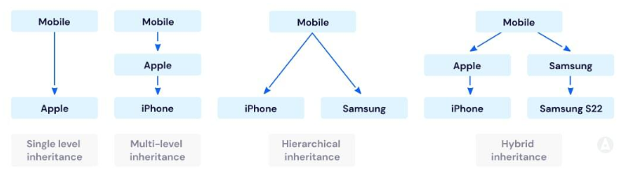
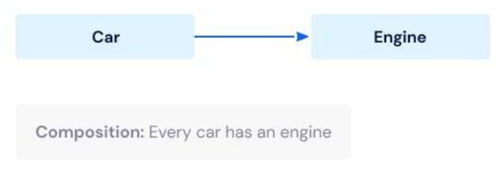

# 상속과 합성

## 상속(Inheritance)
- 부모 클래스와 자식 클래스 사이의 의존성은 컴파일 타임에 해결
- is-a 의 관계
- 부모클래스의 구현에 의존 결합도가 높음
- 클래스 사이의 정적인 관계
- 부모 클래스 안에 구현된 코드 자체를 물려받아 재사용

## 합성(Composition)
- 두 객체 사이의 의존성은 런타임에 해결
- has-a 관계
- 구현에 의존하지 않음
- 내부에 포함되는 객체의 구현이 아닌 인터페이스에 의존
- 객체 사이의 동적인 관계
- 포함되는 객체의 퍼블릭 인터페이스를 재사용

## 상속(Inheritance)이란
클래스 상속을 통해 자식 클래스는 부모 클래스의 자원을 물려받게 되며, 부모 클래스와 다른 부분만 추가하거나 재정의함으로써 기존 코드를 쉽게 확장할 수 있습니다. 그래서 상속 관계를 is-a 관계라고 표현하기도 합니다.



```java
class Mobile {

}

class Apple extends Mobile {

}
```

일반적인 클래스가 이미 구현되어 있는 상태에서 그보다 좀 더 구체적인 클래스를 구현하기 위해 사용되는 기법이며, 그로 인해 상위 클래스의 코드를 하위 클래스가 재사용할 수 있을 뿐입니다.

상속을 사용하는 경우는 명확한 is-a 관계에 있는 경우, 그리고 상위 클래스가 확장할 목적으로 설계되었고 문서화도 잘되어 있는 경우에 사용하면 좋습니다.

상속을 제대로 활용하기 위해서는 부모 클래스의 내부 구현에 대해 상세하게 알아야 하기 때문에 자식 클래스와 부모 클래스 사이의 결합도가 높아질 수 밖에 없습니다. 또한 상속 관계는 컴파일 타임에 결정되고 고정되기 때문에 코드를 실행하는 도중에 변경할 수 없습니다.

따라서 여러 기능을 조합해야 하는 설계에 상속을 이용하게 된다면 모든 조합별로 클래스를 하나하나 추가해 주어야 합니다. 이것을 클래스 폭발 문제라고 합니다.

더군다나 Java8 부터 인터페이스의 디폴트 메서드 기능이 나오면서 인터페이스 내에서 로직 구현이 가능하며, 상속의 장점이 약화되었다고 할 수 있습니다. 그래서 클래스 상속보다는 인터페이스 구현을 이용을 권장합니다.

## 합성(Composition)이란
합성 기법은 기존 클래스를 상속을 통한 확장하는 대신에, 필드로 클래스의 인스턴스를 참조하게 만드는 설계입니다.
자동차(Car) 와 엔진종류(Engine) 간의 관계같이 아주 연관이 없지는 않지만 상속 관계로 맺기에는 애매한 것들을 다루는 것으로 볼 수 있습니다.



```java
class Car {
    Engine engine; // 필드로 Engine 클래스 변수를 갖는다(has)

    Car(Engine engine) {
        this.engine = engine; // 생성자 초기화 할 때 클래스 필드의 값을 정하게 됨
    }

    void drive() {
        System.out.println("%s엔진으로 드라이브", engine.EngineType);
    }

    void break() {
        System.out.println("%s엔진으로 브레이크", engine.EngineType);
    }
}

class Engine {
    String EngineType; // 디젤 / 가솔린 / 전기

    Engine(String type) {
        EngineType = type;
    }
}

..
..

public class Main {
    public static void main(String[] args) {
        Card digelCar = new Car(new Engine("디젤"));
        digelCar.drive();

        Card electroCar = new Car(new Engine("전기"));
        electroCar.drive();
    }
}
```

Car 클래스가 Engine 클래스의 기능이 필요하다고 해서 무조건 상속하지 말고, 따로 클래스 인스턴스 변수에 저장하여 가져다 쓴다는 원리입니다.

이 방식을 포워딩(forwarding)이라고 하며 필드의 인스턴스를 참조해 사용하는 메소드를 포워딩 메소드(forwarding method)라고 부릅니다.

그래서 클래스 간의 합성 관계를 사용하는데 다른 말로 has-a 관계라고도 합니다. 객체 지향에서 다른 클래스를 활용하는 기본적인 방법이 바로 합성을 활용하는 것입니다.

## 상속 대신 합성을 이용하라

### 상속의 문제점
자바의 객체 지향 프로그래밍을 처음 배울 때 클래스와 상속에 대해 배우기 때문에, 마치 상속이 코드 중복을 제거하고 클래스를 묶는 다형성도 이용할 수 있어서 아주 좋은 객체 지향 기술처럼 보여 무분별하게 상속을 남발하는 경우가 있습니다.

하지만 현업 에서도 가능하면 extends를 지양하는 편이며 클래스 상속을 해야 할 때는 정말 개념적으로 연관 관계가 있을 때만 하는 상당히 제한적, 선택적으로 다뤄집니다!

 
### 💡 왜 상속보단 합성(composition)을 사용하라고 권고하는지 상속의 단점을 알아봅시다

> Java의 창시자인 제임스 고슬링(James Arthur Gosling)이 한 인터뷰에서 "내가 자바를 만들면서 가장 후회하는 일은 상속을 만든 점이다"라고 말할 정도입니다.
> 조슈야 블로크의 Effective Java에서는 상속을 위한 설계와 문서를 갖추거나, 그럴 수 없다면 상속을 금지하라는 조언합니다.
> 따라서 추상화가 필요하면 인터페이스로 implements 하거나 객체 지향 설계를 할 땐 합성(composition)을 이용하는 것이 추세입니다.

#### 1. 결합도가 높아짐
결합도는 하나의 모듈이 다른 모듈에 대해 얼마나 많은 지식을 갖고 있는지를 나타내는 의존 정도를 뜻합니다.객체지향 프로그래밍에서는 결합도는 낮을수록, 응집도는 높을수록 좋습니다.

그래서 추상화에 의존함으로써 다른 객체에 대한 결합도는 최소화하고 응집도를 최대화하여 변경 가능성을 최소화할 수 있습니다.

하지만 상속을 하게 되면 부모 클래스와 자식 클래스의 관계가 컴파일 시점에 관계가 결정되어 결합도가 당연히 높아질 수밖에 없습니다.

컴파일 시점에 결정되는 관계는 유연성을 상당히 떨어뜨리고, 실행 시점에 객체의 종류를 변경하는 것이 불가능하여 유기적인 다형성 및 객체지향 기술을 사용할 수 없습니다.

예를 들어 클래스 B가 클래스 A를 상속(extends)한다고 하면, 코드 실행(런타임) 중간에 클래스 C를 상속하도록 바꿀 수 없습니다.

#### 2. 불필요한 기능 상속
부모 클래스에 메소드를 추가했을 때, 자식 클래스에는 적합하지 않은 메소드가 상속되는 문제입니다.

예를 들어서 아래 그림과 같이 Animal 클래스에 fly()라는 메소드를 추가했을때, Tiger 자식 클래스에서는 동작하지 않는 메소드가 되어 버립니다.

물론 메소드를 구현하고 빈칸으로 놔두거나, 클래스를 분리하고 분리하여 해결은 할 수 있지만 결국 복잡해질 뿐입니다.

#### 3. 부모 클래스의 결함이 그대로 넘어옴
만일 상위 클래스에 결함이 있다고 하면, 이를 상속받는 자식 클래스에게도 결함이 넘어오게 됩니다.

결국 자식 클래스에서 아무리 구조적으로 잘 설계하더라도 애초에 부모 클래스에서 결함이 있기 때문에 자식 클래스도 문제가 터지게 됩니다.

#### 4. 부모 클래스와 자식 클래스의 동시 수정 문제
말 그대로 부모 클래스와 자식 클래스 사이의 개념적인 결합으로 인해, 부모 클래스를 변경할 때 자식 클래스도 함께 변경해야 하는 문제를 말합니다.

```java
class Food {
    final int price;
    
    Food(int price) {
        this.price = price;
    }
}

class Bread extends Food {
    public Bread(int price) {
        super(price);
    }
}

public class Main {
    public static void main(String[] args) {
        Food bread = new Bread(1000);
    }
}

..
..

class Food {
    final int price;
    final int count; // 코드 추가
    
    Food(int price, int count) { 
        this.price = price;
        this.count = count; // 코드 추가
    }
}

class Bread extends Food {
    public Bread(int price, int count) {
        super(price, count); // 코드 수정
    }
}

public class Main {
    public static void main(String[] args) {
        Food bread = new Bread(1000, 5); // 코드 수정
    }
}
```

위와 같이 Food 부모 클래스에 count 변수를 추가하면 자식클래스는 물론 호출 부분까지 전부 수정해주어야 합니다. 이는 OCP를 위반합니다.

#### 5. 메서드 오버라이딩의 오동작
자식 클래스가 부모 클래스의 메서드를 오버라이딩할 때 자식 클래스가 부모 클래스의 메서드 호출 방법에 영향을 받는 문제입니다.

부모의 public 메소드는 외부에서 사용하도록 노출한 메소드입니다. 그런데 상속을 하게 된다면, 자식 클래스에서도 부모 클래스의 public 메소드를 이용할 때 의도하지 않은 동작을 수반할 수 있게 될 수 있습니다.
이는 캡슐화를 위반하였다고 하기도 합니다.

> 캡슐화란, 단순히 private 변수로 Getter / Setter를 얘기하는 것이 아닙니다.
캡슐화(정보 은닉)는 객체가 내부적으로 기능을 어떻게 구현하는지를 감추는 것을 의미합니다.
그래서 우리는 클래스 자료형을 이용할 때 내부 동작을 알 필요 없이 단순히 메소드만 갖다 쓰면 됩니다.
단, 내부 동작을 알 필요가 없다는 말은 신뢰성이 보장되어야 한다는 말이기도 합니다.
캡슐화가 깨진 건 이러한 신뢰성이 깨진 것이라고 보면 됩니다. 