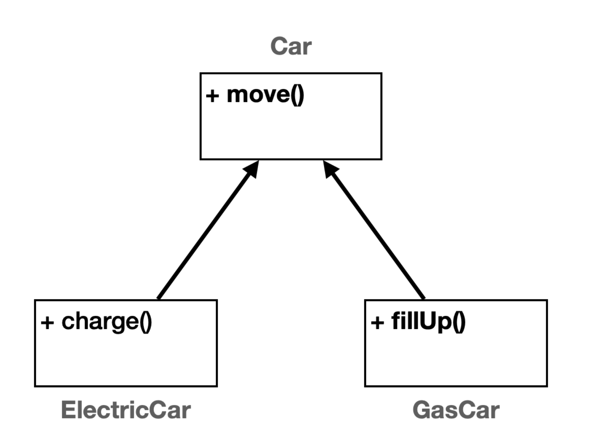
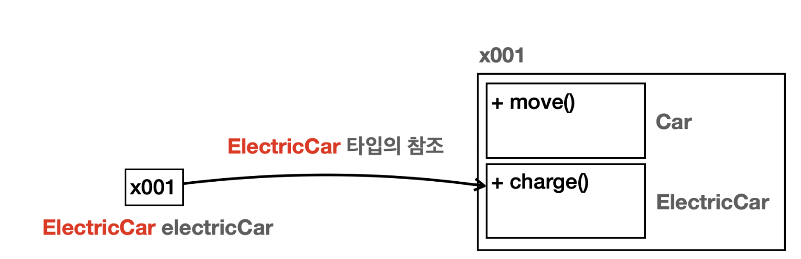
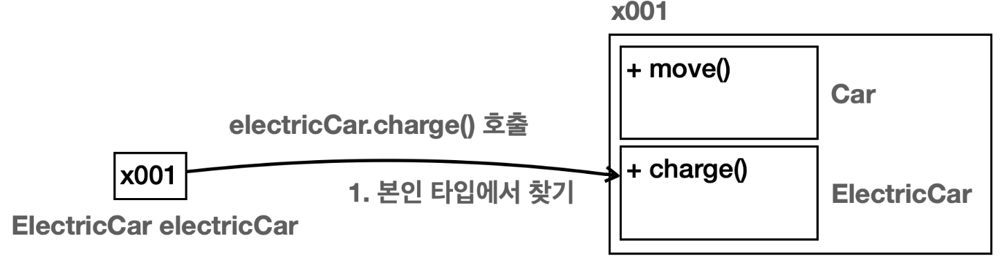
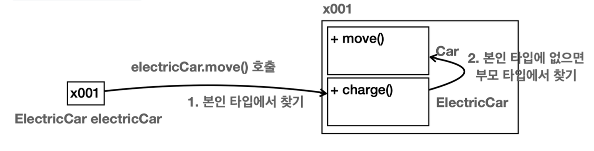
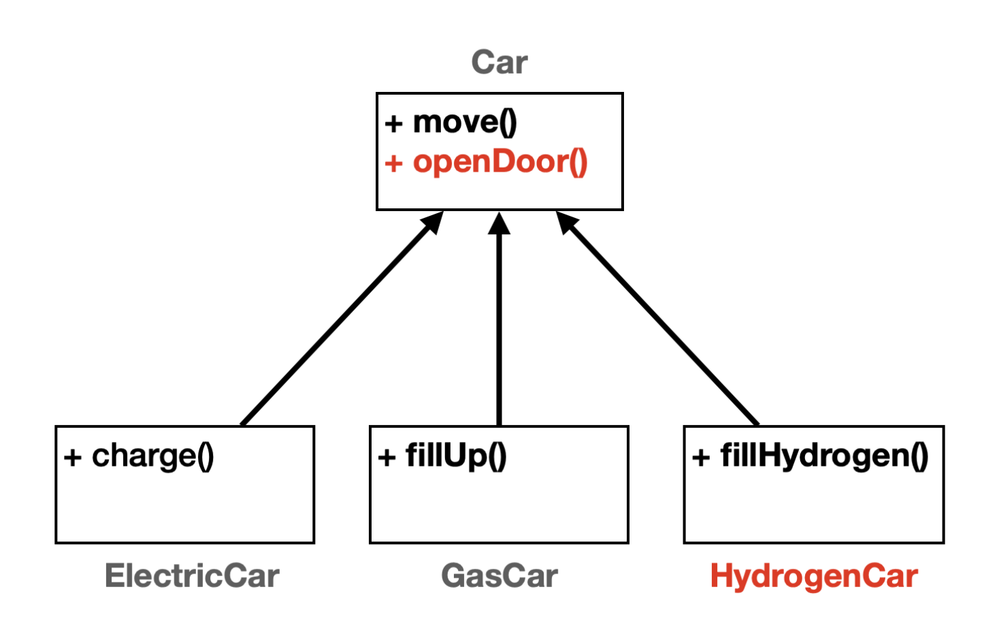
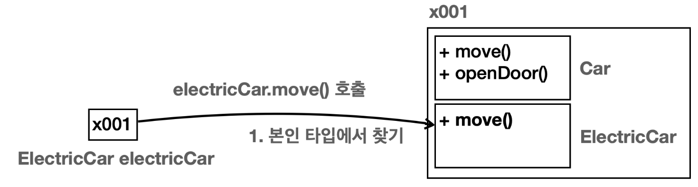

# 상속 관계

상속은 객체 지향 프로그래밍의 핵심 요소 중 하나로, 기존 클래스의 필드와 메서드를 새로운 클래스에서 재사용하게 해준다. 

이름 그대로 기존 클래스의 속성과 기능을 그대로 물려받는 것이다. 상속을 사용하려면 `extends` 키워드를 사용하면 된다. 그리고 `extends` **대상은 하나만 선택**할 수 있다.

## 용어 정리

### 부모 클래스(슈퍼 클래스)

상속을 통해 자신의 필드와 메서드를 다른 클래스에 제공하는 클래스

### 자식 클래스(서브 클래스)

부모 클래스로부터 필드와 메서드를 상속받는 클래스



전기차와 가솔린차가 `Car` 를 상속 받은 덕분에 `electricCar.move()` , `gasCar.move()` 를 사용할 수 있다.

참고로 당연한 이야기지만 상속은 부모의 기능을 자식이 물려 받는 것이다. 따라서 자식이 부모의 기능을 물려 받아서 사용할 수 있다. 

반대로 부모 클래스는 자식 클래스에 접근할 수 없다. 자식 클래스는 부모 클래스의 기능을 물려 받기 때문에 접근할 수 있지만, 그 반대는 아니다. 

부모 코드를 보자! 자식에 대한 정보가 하나도 없다. 반면에 자식 코드는`extends Car` 를 통해서 부모를 알고 있다.

## 상속과 메모리 구조

```java
public class ElectricCar extends Car {
			public void charge() {
				System.out.println("충전합니다.");
			}
}

..
..
ElectricCar electricCar = new ElectricCar();
```



`new ElectricCar()`를 호출하면 `ElectricCar` 뿐만 아니라 상속 관계에 있는 `Car` 까지 함께 포함해서 인스턴
스를 생성한다. 참조값은 `x001` 로 하나이지만 실제로 그 안에서는 `Car` , `ElectricCar` 라는 **두가지 클래스 정보가 공존하는 것이다.**

상속이라고 해서 단순하게 부모의 필드와 메서드만 물려 받는게 아니다. `상속 관계를 사용하면 부모 클래스도 함께 포함 해서 생성된다.` 외부에서 볼때는 하나의 인스턴스를 생성하는 것 같지만 내부에서는 부모와 자식이 모두 생성되고 공간 도 구분된다.	

`electricCar.charge()` **호출**


`electricCar.charge()` 를 호출하면 참조값을 확인해서 `x001.charge()` 를 호출한다. 따라서 `x001` 을 찾아서 `charge()` 를 호출하면 되는 것이다. 그런데 상속 관계의 경우에는 내부에 부모와 자식이 모두 존재한다. 이때 부모인`Car` 를 통해서 `charge()` 를 찾을지 아니면 `ElectricCar` 를 통해서 `charge()` 를 찾을지 선택해야 한다.

⭐️ 이때는 **호출하는 변수의 타입(클래스)을 기준으로 선택**한다. 

`electricCar` 변수의 타입이 `ElectricCar` 이므로 인스턴스 내부에 같은 타입인 `ElectricCar` 를 통해서 `charge()` 를 호출한다.

`electricCar.move()` **호출**

`electricCar.move()` 를 호출하면 먼저 `x001` 참조로 이동한다. 내부에는 `Car`, `ElectricCar` 두가지 타입이있다. 이때 호출하는 변수인 `electricCar` 의 타입이 `ElectricCar` 이므로 이 타입을 선택한다.
그런데 `ElectricCar` 에는 `move()` 메서드가 없다. 상속 관계에서는 자식 타입에 해당 기능이 없으면 부모 타입으로 올라가서 찾는다. 이 경우 `ElectricCar` 의 부모인 `Car` 로 올라가서 `move()` 를 찾는다. 부모인 `Car` 에`move()` 가 있으므로 부모에 있는 `move()` 메서드를 호출한다.

만약 부모에서도 해당 기능을 찾지 못하면 더 상위 부모에서 필요한 기능을 찾아본다. 부모에 부모로 계속 올라가면서 필드나 메서드를 찾는 것이다. 물론 계속 찾아도 없으면 컴파일 오류가 발생한다.

⭐️ **지금까지 설명한 상속과 메모리 구조는 반드시 이해해야 한다!**

- ⭐️ 상속 관계의 객체를 생성하면 그 내부에는 부모와 자식이 모두 생성된다.
- 상속 관계의 객체를 호출할 때, 대상 타입을 정해야 한다. 이때 호출자의 타입을 통해 대상 타입을 찾는다.
- 현재 타입에서 기능을 찾지 못하면 상위 부모 타입으로 기능을 찾아서 실행한다. 기능을 찾지 못하면 컴파일 오류가 발생한다.

## 상속과 기능 추가

수소차에 대한 클래스를 추가하는 예시를 들어보자.

```java
package extends1.ex3;

public class HydrogenCar extends Car {

    public void fillHydrogen() {
        System.out.println("수소를 충전합니다.");
    }

}
```

### 기능 추가와 클래스 확장

상속 관계 덕분에 중복은 줄어들고, 새로운 수소차를 편리하게 확장(extend)한 것을 알 수 있다.

## 상속과 메서드 오버라이딩

부모 타입의 기능을 자식에서는 다르게 재정의 하고 싶을 수 있다.
예를 들어서 자동차의 경우 `Car.move()` 라는 기능이 있다. 이 기능을 사용하면 단순히 "차를 이동합니다."라고 출력한다. 전기차의 경우 보통 더 빠르기 때문에 전치가가 `move()` 를 호출한 경우에는 "전기차를 빠르게 이동합니다."라고 출력을 변경하고 싶다.

이렇게 부모에게서 상속 받은 기능을 자식이 **재정의 하는 것을 메서드 오버라이딩(Overriding)** 이라 한다.

```java
package extends1.overriding;

public class ElectricCar extends Car {

    @Override
    public void move() {
        System.out.println("전기차를 빠르게 이동합니다.");
    }

    public void charge() {
        System.out.println("충전합니다.");
    }
}
```

### `@Override`

`@` 이 붙은 부분을 애노테이션이라 한다. 애노테이션은 주석과 비슷한데, 프로그램이 읽을 수 있는 특별한 주석이라 생각하면 된다. 애노테이션에 대한 자세한 내용은 따로 설명한다.

이 애노테이션은 상위 클래스의 메서드를 오버라이드하는 것임을 나타낸다.이름 그대로 오버라이딩한 메서드 위에 이 애노테이션을 붙여야 한다.

⭐️ 컴파일러는 이 애노테이션을 보고 메서드가 정확히 오버라이드 되었는지 확인한다. 

⭐️ 오버라이딩 조건을 만족시키지 않으면 컴파일 에러를 발생시킨다. 따라서 실수로 오버라이딩을 못하는 경우를 방지해준다. 예를 들어서 이 경우에 만약 부모에 `move()` 메서드가 없다면 컴파일 오류가 발생한다. 

참고로 이 기능은 필수는 아니지만 `코드의 명확성`을 위해 붙여주는 것이 좋다.

### 오버라이딩과 메모리 구조

1. `electricCar.move()` 를 호출한다.
2. 호출한 `electricCar` 의 타입은 `ElectricCar` 이다. 따라서 인스턴스 내부의 `ElectricCar` 타입에서 시작한다.
3. `ElectricCar` 타입에 `move()` 메서드가 있다. 해당 메서드를 실행한다. 이때 실행할 메서드를 이미 찾았으므로 부모 타입을 찾지 않는다.

### **오버로딩(Overloading)과 오버라이딩(Overriding)**

1. 메서드 오버로딩

메서드 이름이 같고 매개변수(파라미터)가 `다른 메서드를 여러개 정의하는 것`을 메서드 오버로

딩(Overloading)이라 한다. 오버로딩은 번역하면 과적인데, 과하게 물건을 담았다는 뜻이다. 따라서 같은 이름의 메서드를 여러개 정의했다고 이해하면 된다.

1. 오버라이딩

메서드 오버라이딩은 `하위 클래스에서 상위 클래스의 메서드를 재정의하는 과정`을 의미한다.
따라서 상속 관계에서 사용한다. 부모의 기능을 자식이 다시 정의하는 것이다. 오버라이딩을 단순히 해석하면 무언가를 넘어서 타는 것을 말한다. 자식의 새로운 기능이 부모의 기존 기능을 넘어 타서 기존 기능을 새로운 기능으로 덮어버린다고 이해하면 된다. 오버라이딩을 우리말로 번역하면 무언가를 다시 정의한다고 해서 **`재정의`**라 한다. 상속 관계에서는 기존 기능을 다시 정의한다고 이해하면 된다. 실무에서는 메서드 오버라이딩, 메서드 재정의 둘다 사용한다.

### 메서드 오버라이딩 조건

메서드 오버라이딩은 다음과 같은 까다로운 조건을 가지고 있다.
다음 내용은 아직 학습하지 않은 내용들도 있으므로 모두 이해하려고 하기 보다는 참고만 하자.
지금은 단순히 **부모 메서드와 같은 메서드를 오버라이딩 할 수 있다 정도로 이해하면 충분한다.**

- **메서드 이름**: 메서드 이름이 같아야 한다.
- **메서드 매개변수(파라미터)**: 매개변수(파라미터) 타입, 순서, 개수가 같아야 한다.
- **반환 타입**: **반환 타입이 같아야 한다**. 단 반환 타입이 하위 클래스 타입일 수 있다.
- **접근 제어자**: 오버라이딩 메서드의 접근 제어자는 상위 클래스의 메서드보다 더 제한적이어서는 안된다. 예를 들 어, 상위 클래스의 메서드가 `protected` 로 선언되어 있으면 하위 클래스에서 이를 `public` 또는 `protected` 로 오버라이드할 수 있지만, `private` 또는 `default` 로 오버라이드 할 수 없다.
- **예외**: 오버라이딩 메서드는 상위 클래스의 메서드보다 더 많은 체크 예외를 `throws` 로 선언할 수 없다. 하지만 더 적거나 같은 수의 예외, 또는 하위 타입의 예외는 선언할 수 있다. 예외를 학습해야 이해할 수 있다. 예외는 뒤 에서 다룬다.
- `static` , `final` , `private` : 키워드가 붙은 메서드는 오버라이딩 될 수 없다. `static` 은 클래스 레벨에서 작동하므로 인스턴스 레벨에서 사용하는 오버라이딩이 의미가 없다. 쉽게 이 야기해서 그냥 클래스 이름을 통해 필요한 곳에 직접 접근하면 된다. `final` 메서드는 재정의를 금지한다. `private` 메서드는 해당 클래스에서만 접근 가능하기 때문에 하위 클래스에서 보이지 않는다. 따라서 오 버라이딩 할 수 없다.
- **생성자 오버라이딩**: 생성자는 오버라이딩 할 수 없다.