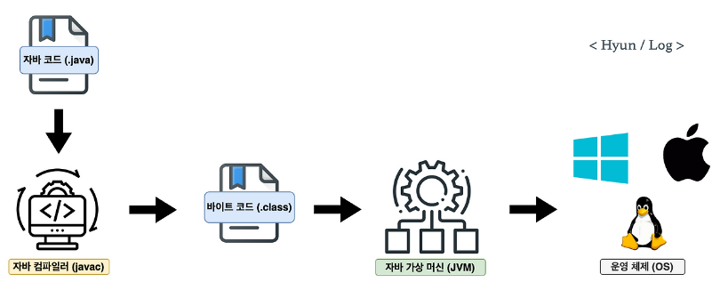
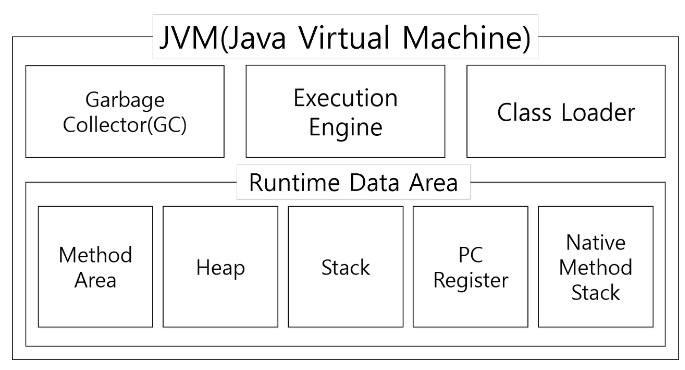
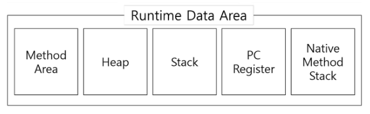

JVM의 구조와 Java의 실행방식을 설명해주세요.

# JVM 의 동작 원리

JVM 의 동작 원리는 크게 3가지로 나뉩니다.

1. 코드작성

    Java 로 코드를 작성합니다. 작성한 Java 코드는 `.java` 파일로 저장됩니다.

2. 컴파일

    `.java` 파일이 자바 컴파일러(javac)에 의해 `.class` 파일로 변환됩니다. 이 `.class` 파일은 자바 코드가 바이트 코드(JVM 에서 작동하도록 만든 이진 코드)로 변환되어 있습니다.
    
    여기서 바이트 코드란 JVM 에서 작동하도록 만든 이진 코드입니다. 즉, JVM 이 이해할 수 있는 언어로 변환된 코드이며 명령어의 크기가 1 바이트라서 자바 바이트 코드라고 불리고, 자바 코드를 배포하는 가장 작은 단위입니다.

3. JVM 실행

    `.class` 파일의 바이트 코드를 읽고, 각각의 컴퓨터가 이해할 수 있는 기계어로 변환하여 실행합니다.

# JVM 의 구조

jvm은 크게 클래스 로더(class loader), 실행엔진(execution engine), 런타임 데이터 영역(runtime data area), GC(Garbage Collector)로, 4가지로 나눌 수 있습니다.

## 1. 클래스 로더
자바는 컴파일 타임이 아니라 런타임(class 파일을 실행할 때) 시점, 즉 클래스를 처음으로 참조할 때 해당 클래스를 로드하고 링크를 통해 배치하는 작업을 수행하는 모듈입니다. -> 동적 로딩

이 동적 로딩을 담당하는 것이 바로 클래스 로더입니다. 실행엔진이 클래스 로더에 의해 런타임 데이터 영역에 올라온 바이트 코드를 실행하면서 애플리케이션이 실행됩니다.

## 2. 런타임 데이터 영역
JVM 이 운영 체제 위에서 실행될 때, 할당 받는 메모리 영역으로 다음과 같이 분류됩니다.

**Method 영역과 Heap 영역은 모든 쓰레드에서 공유되고, 나머지 영역(pc register, jvm stack, native method stack)은 쓰레드마다 각각 존재합니다.**

### Method 영역
모든 스레드가 공유하는 영역으로, 클래스, 인터페이스, 메소드, 필드, Static 변수 등의 바이트 코드를 보관합니다.

### Heap 영역
모든 스레드가 공유하는 영역으로, new 키워드로 생성된 모든 객체와 배열이 저장되는 영역입니다. 또한, 메소드 영역에 로드된 클래스만 생성이 가능하고 Garbage Collector 가 참조되지 않는 메모리를 확인하고 제거하는 영역입니다.

### Stack 영역
스레드마다 별도로 존재하며, 메서드 호출 시마다 각각의 스택 프레임(그 메서드만을 위한 공간)이 생성합니다. 그리고 메서드 안에서 사용되는 값들을 저장하고, 호출된 메서드의 매개변수, 지역변수, 리턴 값 및 연산 시 일어나는 값들을 임시로 저장합니다. 마지막으로, 메서드 수행이 끝나면 프레임별로 삭제합니다.

### pc register
스레드마다 별도로 존재하며, 스레드가 시작될 때 생성됩니다. 쓰레드가 어떤 부분을 무슨 명령으로 실행해야할 지에 대한 기록을 하는 부분으로 현재 수행중인 JVM 명령의 주소를 갖습니다.

### native method stack
native method stack은 자바 외의 언어로 작성된 네이티브 코드를 위한 스택입니다.

## 3. 실행엔진
메모리에 적재된 바이트코드(.class) 를 기계어로 변환해 명령어 단위로 읽어 실행하는 역할을 합니다.
위와 같은 역할을 수행하기 위해 두가지 방식을 사용합니다.

### 1. 인터프리터 방식
바이트코드(.class) 를 한 줄씩 읽어서 실행합니다. 하지만 같은 코드를 실행할 때마다 바이트 코드를 매번 해석해야해서 속도가 느리다는 단점이 있습니다.

### 2. JIT(Just In Time) Compiler
인터프리터의 단점을 보완하기 위해 도입된 것으로 프로그램 실행 중에 바이트 코드 전체 또는 일부를 네이티브 코드로 컴파일하고, 직접 실행합니다.

설명만 봤을 때는 JIT 컴파일러만 사용할 것처럼 보이지만 JVM 실행 엔진에서는 이 두가지 방식을 함께 사용합니다.

프로그램 실행 초기에는 인터프리터 방식으로 빠르게 시작하고, 실행 중에 JIT 컴파일러가 분석을 통해 성능이 중요한 부분을 식별해 네이티브 코드로 컴파일합니다.

## 4. GC(Garbage Collector)
힙 메모리 영역에 생성된 객체들 중, 더 이상 참조되지 않는 객체를 자동으로 검색해 제거합니다.

URL : https://seung-seok.tistory.com/entry/Java-JVM-%EC%9D%B4%EB%9E%80